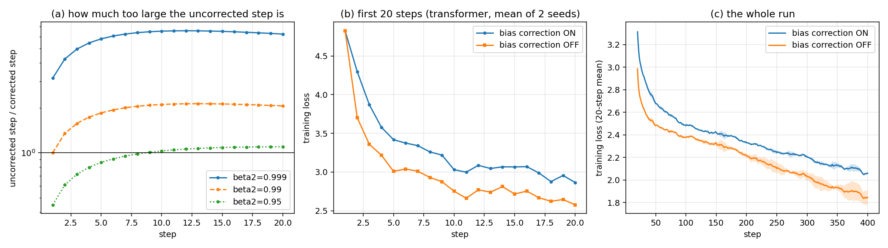
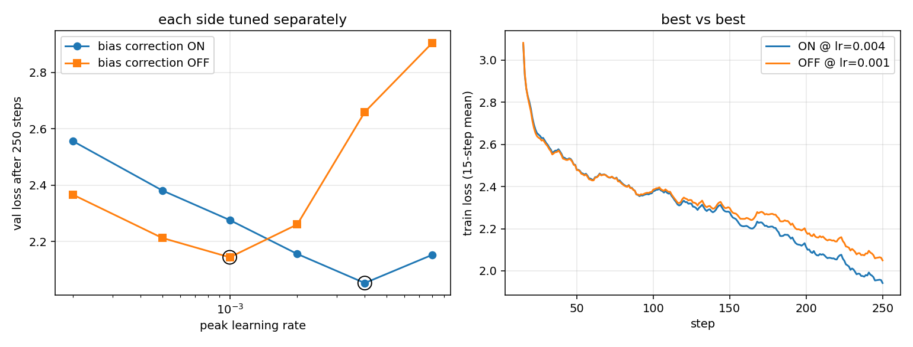
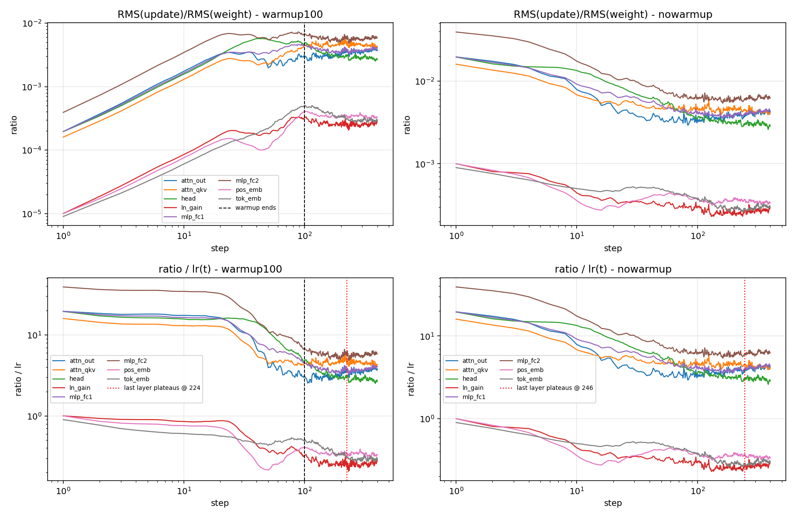
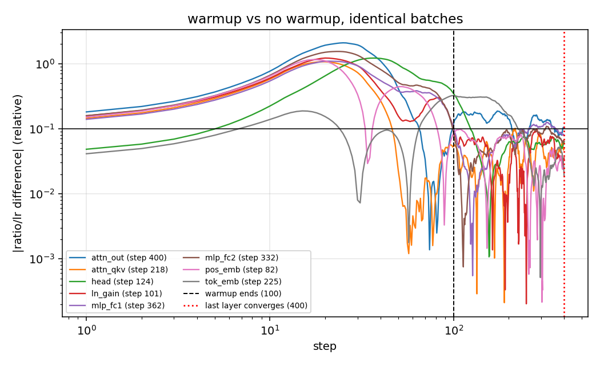
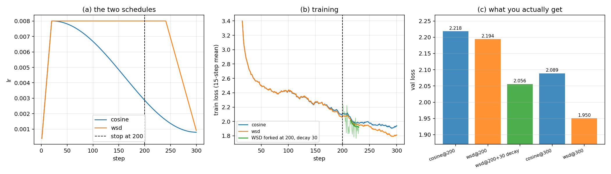
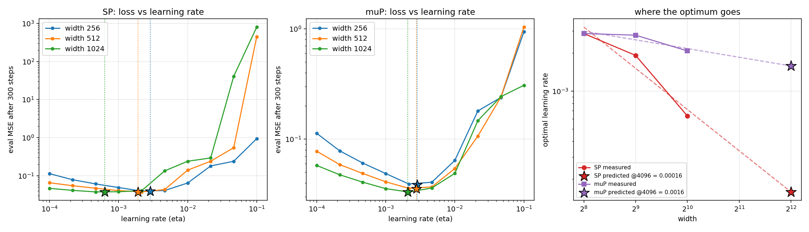
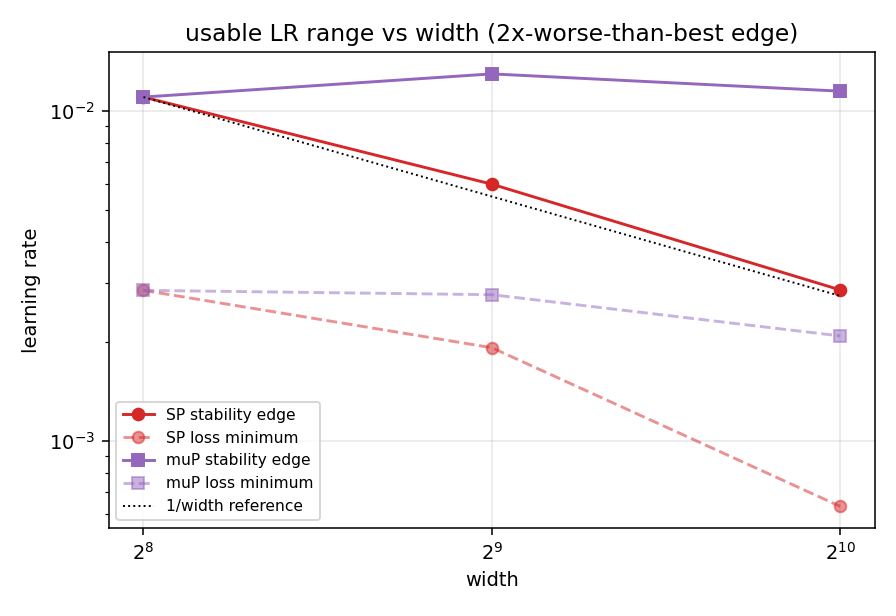
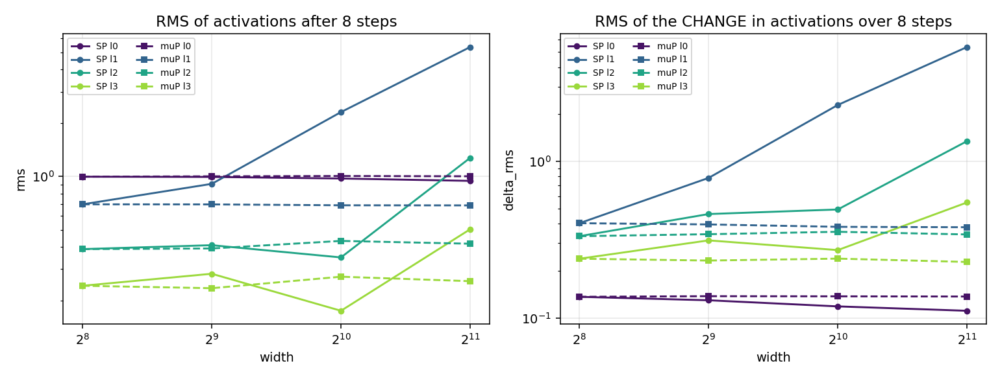

# Adam, by hand and under load

Five experiments on Adam and learning-rate schedules. Everything runs on CPU in
about 35 minutes total. Every number below is read back out of the JSON files in
`results/` by `src/summarize.py`, so nothing here is typed from memory.

```
pip install torch matplotlib numpy
cd src
python test_myadam.py               # equivalence test, ~4 s
python e01_adam_by_hand.py          # part 1, instant
python e02_bias_correction.py       # part 2, ~3 min
python e02b_tuned_bias_correction.py# part 2 rematch, ~11 min
python e03_update_ratio.py          # part 3, ~2 min
python e04_schedules.py             # part 4, ~11 min
python e05_width_lr_sweep.py        # part 5, ~7 min
python e05b_stability_edge.py       # part 5 analysis, instant
python summarize.py                 # reprint every quoted number
```

Models: a 3-layer pre-LN character transformer (d_model 128, 4 heads, seq 128,
0.64M params, vocab 96) on a 1.5 MB corpus of Python standard-library source,
and an MLP on an online teacher-student regression for the width sweep. Both are small
enough to sweep properly on two cores, which mattered more than realism — an
unswept comparison would not have been worth reporting.

---

## Requirements checklist

| asked for | where | done |
|---|---|---|
| One weight, five gradients; compute m, v, m̂, v̂ and the step by hand | §1, `e01_adam_by_hand.py` | yes — full table |
| Check **each** against PyTorch, agreeing to several decimal places | §1 | yes — all six quantities checked separately; exact on `w` in float64, ≥8 significant digits in float32 |
| Disable bias correction, plot the first twenty steps both ways | §2, `figures/e02_bias_correction.png` panel (b) | yes |
| Report the number of steps after which the difference stops mattering | §2 | yes — 1660 / 2327 / 3916 steps for 10% / 5% / 1% at β₂=0.999, plus β₂=0.99 and 0.95 |
| Log the update-to-weight ratio for every layer | §3, `results/e03_update_ratio.json` (`per_tensor_ratio`) | yes — every parameter tensor, every step |
| Identify the step at which warmup stops changing it | §3 | yes — three definitions, step 100 / 109–224 / median 221 |
| Train the same model twice for 300 steps, cosine and WSD, stop both at 200 | §4, `e04_schedules.py` | yes — same architecture and init seed, 2 seeds each |
| Report both losses and state which model you would keep | §4 | yes — 2.218 vs 2.194 at step 200; keep WSD |
| Sweep LR at widths 256 / 512 / 1024, plot loss vs LR, mark the three minima | §5, `figures/e05_width_lr_sweep.png` | yes — marked with stars in both panels |
| State the value you would use at width 4096 and how confident you are | §5 | yes — η=2.2e-3 under muP (1.4e-4 on hidden/readout), 1.6e-4 under SP; confidence stated per route |
| Tune both sides before accepting a comparison | §2b, §4, §5, and "On tuning both sides" | yes — separate sweeps for bias-correction on/off, for cosine and WSD, and for SP and muP |
| Detailed README plus support code | this file, `src/`, `results/`, `figures/` | yes |

### Deviations, stated up front

- **The width sweep uses an MLP, not the transformer.** A width-1024 transformer
  LR sweep is roughly 100× the compute available here. Parts 2–4 use the
  transformer; part 5 uses an MLP on online teacher-student regression. The
  width-4096 number is therefore a claim about that MLP setup, and §5 says so in
  the confidence discussion rather than burying it.
- **"The first twenty steps" is not enough to answer part 2's own question.** The
  plot is there as asked, but at β₂=0.999 the discrepancy is still near its
  maximum at step 20, so the "stops mattering" answer comes from the closed form
  extended to ~4000 steps.
- **Biases are logged but excluded from the part-3 analysis.** They initialise to
  exactly zero, so RMS(update)/RMS(weight) has a zero denominator at step 1. The
  raw per-tensor series for them is still in the JSON.
- **Two seeds everywhere.** Enough to show that the step-200 schedule gap is
  inside the noise and the muP curves are not; not enough for confidence
  intervals on individual minima.
- **Every LR grid was widened once.** Part 4's first grid topped out at 8e-3 and
  both schedules chose the edge; part 5's first task was too easy and the minima
  were unidentifiable. Both were re-run rather than reported.

---

## 1. Adam by hand

One scalar weight `w0 = 0.7`, five prescribed gradients
`[+0.30, -0.10, +0.25, +0.05, -0.40]`, `lr = 0.1`, `betas = (0.9, 0.999)`,
`eps = 1e-8`. Computed in plain Python floats — no tensors — in
`src/e01_adam_by_hand.py`:

| t | g_t | m_t | v_t | m̂_t | v̂_t | step | w_t |
|---|-----|-----|-----|-------|-------|------|-----|
| 1 | +0.30 | +0.030000000 | 0.000090000 | +0.300000000 | 0.090000000 | +0.099999997 | 0.600000003 |
| 2 | -0.10 | +0.017000000 | 0.000099910 | +0.089473684 | 0.049979990 | +0.040021855 | 0.559978148 |
| 3 | +0.25 | +0.040300000 | 0.000162310 | +0.148708487 | 0.054157503 | +0.063900819 | 0.496077329 |
| 4 | +0.05 | +0.041270000 | 0.000164648 | +0.120005816 | 0.041223739 | +0.059105593 | 0.436971736 |
| 5 | -0.40 | -0.002857000 | 0.000324483 | -0.006976631 | 0.065026550 | -0.002735901 | 0.439707637 |

Feeding the identical gradients to `torch.optim.Adam` and checking **each of
the six quantities separately**, worst disagreement over the five steps:

| quantity | float64 | float32 |
|---|---|---|
| m | 3.04e-18 | 1.19e-09 |
| v | 5.42e-20 | 4.29e-11 |
| m̂ | 7.81e-18 | 1.19e-08 |
| v̂ | 1.39e-17 | 8.64e-09 |
| step | 3.47e-17 | 3.24e-08 |
| w | **0.00e+00** | 5.93e-08 |

PyTorch stores only `m` and `v` (`exp_avg`, `exp_avg_sq`) — it folds both
corrections into `step_size` and `denom` and never materialises `m̂` and `v̂`, so
those two rows reconstruct them from PyTorch's own buffers and its own step
counter rather than from mine.

In float64 the agreement is **exact on `w`** — bit-for-bit zero at all five
steps — and no quantity disagrees by more than 3.5e-17. In float32 the worst
gap anywhere is 5.9e-8, i.e. every quantity matches to at least 8 significant
decimal places, which is float32 rounding and nothing else.

Three things that fell out of writing it by hand:

- **The first step is exactly ±lr.** At t=1, `m̂ = g` and `v̂ = g²`, so the step is
  `lr·g/(|g| + eps)`. Measured: `step/lr = 0.99999997`, the shortfall being `eps`.
  Adam's step size at t=1 carries no information about the gradient's magnitude
  at all. This is the fact that makes part 3's ratios predictable in advance.
- **Where `eps` goes matters more than it looks.** PyTorch adds `eps` *after*
  bias-correcting `v` (`lr·m̂/(√v̂ + eps)`). The original paper's alternative form
  puts it inside the root (`lr·m̂/√(v̂ + eps)`). Same algebra, different answer:
  final `w` = 0.439707649 instead of 0.439707637, a gap of 1.2e-8 after five
  steps of a single scalar — the same order as the float32 rounding above, and
  unlike rounding it is systematic, so it compounds over a real run. If a
  reimplementation disagrees with PyTorch at the 1e-8 level, this is the first
  place to look.
- **Step 5 is the interesting one.** `g_5 = -0.40` is the largest gradient of the
  run, yet it produces the *smallest* step (-0.0027). `m` had accumulated +0.041
  from four positive-ish gradients, so one big negative gradient only just
  cancels it. Adam's step follows the sign agreement of recent gradients, not the
  current one.

`src/test_myadam.py` checks the longhand optimizer used in parts 2–3 against
`torch.optim.Adam` on every parameter of the transformer:
float64 max |diff| after 10 steps = **7.1e-14**, float32 = 4.8e-5 (PyTorch folds
the corrections into `step_size` and `denom`; this implementation divides `m` and
`v` directly — same algebra, different rounding, compounded).

---

## 2. Bias correction on and off



**Closed form first.** For a stationary gradient the two updates differ by
exactly

```
r(t) = sqrt(1 - beta2^t) / (1 - beta1^t)        corrected / uncorrected
```

so the uncorrected step is `1/r(t)` times **too large**, not too small. With
`beta1=0.9, beta2=0.999`: 3.16× at step 1, rising to a peak of **6.57× at step
12**, still 6.24× at step 20. It gets worse before it gets better, because
`1 - beta1^t` saturates in ~10 steps while `1 - beta2^t` needs ~1000.

**Number of steps after which the difference stops mattering**, defined as
`|r(t) - 1|` staying under a tolerance forever after:

| beta2 | within 10% | within 5% | within 1% |
|-------|-----------|----------|----------|
| 0.999 | 1660 | 2327 | 3916 |
| 0.99  | 166  | 232  | 390  |
| 0.95  | 6    | 42   | 76   |

The timescale is `1/(1 - beta2)`, and **twenty steps is nowhere near it** at the
default `beta2 = 0.999` — at step 20 the per-step discrepancy is still 6.2×, near
its worst. The plot's left panel shows the first twenty steps; the honest answer
to "when does it stop mattering" is ~1700 steps for 10% and ~3900 for 1%. If
you train with `beta2 = 0.95` (common for LLMs), it is 6 and 76 steps — which is
why bias correction feels optional there and is not at 0.999.

**Empirically** (both runs at `lr=1e-3` constant, no warmup, identical batches,
2 seeds, 400 steps): loss at step 20 is 2.865 with correction and 2.576 without;
at step 400, 2.103 vs 1.901. The gap never falls inside the seed-to-seed band
within the 400-step window.

**But that comparison is worthless, and here is why.** Turning off bias
correction does not leave the optimizer alone — it multiplies the early step
sizes by up to 6.6×. The uncorrected run "wins" because `1e-3` was below the
useful LR for this model and the accidental inflation partly fixed that. So both
sides get their own sweep (`e02b`, 250 steps, val loss):

| peak LR | 2e-4 | 5e-4 | 1e-3 | 2e-3 | 4e-3 | 8e-3 |
|---------|------|------|------|------|------|------|
| bias correction ON  | 2.557 | 2.382 | 2.277 | 2.156 | **2.053** | 2.153 |
| bias correction OFF | 2.367 | 2.213 | **2.145** | 2.261 | 2.660 | 2.905 |



Tuned against tuned: **2.053 (on) vs 2.145 (off)** — correction wins by 0.09
nats, and the optimal LR moves 4× lower without correction — the same order as
the 3.2–6.6× step inflation the closed form predicts for the early steps.
Bias correction is not mainly a performance feature; it is a
*reparameterization* feature. It makes the number you type as `lr`
mean the same thing at step 1 as at step 10000, which is what lets a warmup
schedule, an LR sweep, or a paper's hyperparameters transfer at all.

---

## 3. Update-to-weight ratio, per layer



Logged for every parameter tensor at every step:
`ratio_l(t) = RMS(w_l(t+1) − w_l(t)) / RMS(w_l(t))`. Peak LR 1e-3, 100-step
linear warmup, then constant, 400 steps. Per-tensor series are in
`results/e03_update_ratio.json`; the plots group them by layer type (averaged
over the 3 blocks). Biases are excluded — they initialise to exactly 0, so the
ratio is undefined for them, which is worth knowing before you plot it.

**Step 1 is fully predictable from part 1.** Adam's first update is exactly ±lr
per element, so `ratio_l(1) = lr / RMS(w_l(0))` — it measures the initialisation,
not the gradient. Measured `ratio/lr` at step 1:

| layer | ratio/lr at step 1 | why |
|---|---|---|
| mlp_fc2 | 39.2 | fan_in 512, PyTorch uniform init → RMS = 1/√(3·512) |
| mlp_fc1, attn_out, head | 19.5–19.6 | fan_in 128, same rule |
| attn_qkv | 16.0 | `MultiheadAttention` uses Xavier, not the Linear default |
| ln_gain, pos_emb | 1.00 | gains init to 1, positions to N(0,1) |
| tok_emb | 0.90 | N(0,1), slightly reduced by sparse token coverage |

By late training `ratio/lr` has fallen to 2.8–5.8 for the weight matrices and
0.26–0.33 for the unit-scale tensors: weights grow, and `|m|/√v̂` drops below 1
once gradients stop agreeing with themselves. Steady-state ratios land at
2.6e-4 (LayerNorm gains) to 5.8e-3 (mlp_fc2) — a 22× spread across layers at a
single global LR, which is the practical argument for per-tensor LR scaling.

**The step at which warmup stops changing it.** Three answers, increasingly
honest:

1. **Mechanically: step 100.** The LR stops moving when warmup ends, and the raw
   ratio tracks `lr(t)` almost perfectly until then (top-left panel is a straight
   line on log-log up to step 100, then flat).
2. **Normalising by `lr(t)` — steps 109 to 224.** `ratio/lr` is *not* flat during
   warmup: it sits at ~20 for the first 20 steps and then falls to ~4. Per group,
   it settles within ±10% of its late value at step 109 (mlp_fc1) through 224
   (attn_qkv). So something other than the LR is still changing the ratio well
   past the end of warmup.
3. **Against a no-warmup control — median step 221.** Same init, same batches,
   warmup vs none, so the difference between the two `ratio/lr` curves is caused
   by warmup and nothing else. They differ by up to 2× around step 20, then
   converge: within 10% from step 82 (pos_emb), 101 (ln_gain), 124 (head), 218
   (attn_qkv), 225 (tok_emb), 332 (mlp_fc2), 362 (mlp_fc1), and attn_out is
   still hovering at the 10% line at step 400.
   Median 221 — roughly **2× the warmup length**, not 1×.



What warmup actually buys, from the no-warmup run: the step-1 ratio is 2.9–6.5×
its own steady-state level (mlp_fc2 moves 3.9% of its norm in one step). Warmup
removes that spike; it does not otherwise change where the ratio ends up.

---

## 4. Cosine vs WSD, both stopped at step 200

Budget 300 steps, 20-step warmup, cosine decays to 0.1×peak over the whole run,
WSD holds peak then decays linearly over the last 20% (steps 240–300). Peak LR
swept separately per schedule; both optima are interior to the grid, which took
two attempts — the first grid topped out at 8e-3 and both schedules picked the
edge, so the grid was widened rather than the result reported.

| peak LR | 1e-3 | 2e-3 | 4e-3 | 8e-3 | 1.6e-2 | 3.2e-2 |
|---------|------|------|------|------|--------|--------|
| cosine | 2.388 | 2.289 | 2.162 | **2.035** | 2.110 | 2.397 |
| WSD    | 2.294 | 2.143 | 1.950 | **1.912** | 2.008 | 2.315 |

Both tune to 8e-3. Final head-to-head, 2 seeds each:



| | val loss @200 | val loss @300 |
|---|---|---|
| cosine (lr 8e-3) | 2.218  (2.166, 2.270) | 2.089  (2.035, 2.142) |
| WSD (lr 8e-3)    | 2.194  (2.130, 2.258) | **1.950**  (1.912, 1.989) |
| WSD forked at 200, decayed over 30 more steps | — | 2.056 (seed 0) |

**Both losses at the stopping point: cosine 2.218, WSD 2.194.** Read that
difference as zero: the seed spread within each schedule is ~0.10–0.13, four to
five times the gap. Two seeds cannot separate them at step 200.

**I would keep the WSD model**, for three reasons, only one of which is the
step-200 number:

1. At the full budget WSD wins by 0.139 nats and the per-seed intervals do not
   overlap (1.912/1.989 vs 2.035/2.142). That gap is real; the step-200 one is not.
2. The step-200 WSD checkpoint is a *better asset* than the step-200 cosine
   checkpoint even at equal loss. Annealing it over 30 extra steps (10% of the
   budget) reaches **2.056**, beating cosine's own step-200 checkpoint by 0.11
   and nearly matching cosine's full 300-step result (2.035, seed 0) with 70
   fewer steps. Nothing comparable can be done with a cosine run truncated at
   200 — its LR has already spent two thirds of its decay on a horizon you
   turned out not to want.
3. Stopping early is exactly the case WSD is designed for. Cosine bakes the
   total step count into the shape of the curve; a cosine run cut at 200 is
   mistuned for 200 and wasted for 300. WSD's constant phase means the decision
   about where to stop is still open at step 200.

The honest caveat: at 300 steps this model is nowhere near convergence, and
WSD's advantage at short horizons is partly that it spends more of the budget at
high LR. At a horizon long enough for cosine's late low-LR phase to pay off, the
ranking can narrow. What is robust here is the asymmetry in *optionality*, not
the size of the gap.

---

## 5. Learning rate vs width, 256 / 512 / 1024



Online teacher-student regression, MLP with 3 hidden matrices, 300 steps,
batch 128, 10 LRs from 1e-4 to 1e-1, 2 seeds. Loss is eval MSE on noiseless
targets; predicting the mean scores 0.238, so the numbers below sit ~6× below
trivial and the model is still far from the noise floor — which is the point,
because on an easier version of this task every LR from 1e-4 to 5e-3 scored the
same and the minimum was not identifiable at all.

Swept under two parameterizations on the same x-axis. At width 256 = base width
they are the same model, and the two curves coincide exactly — that is the
sanity check that the muP implementation has not changed anything it shouldn't.

| | width 256 | width 512 | width 1024 | slope | predicted @4096 |
|---|---|---|---|---|---|
| **SP** minimum (parabola-refined) | 2.86e-3 | 1.92e-3 | 6.34e-4 | width^-1.09 | **1.58e-4** |
| SP minimum (grid) | 2.15e-3 | 2.15e-3 | 4.64e-4 | | |
| **muP** minimum (refined) | 2.86e-3 | 2.77e-3 | 2.08e-3 | width^-0.23 | **1.58e-3** |
| muP minimum (grid) | 2.15e-3 | 2.15e-3 | 2.15e-3 | flat | 2.15e-3 |

The three marked minima are the stars in the figure. Under SP the optimum moves
left by roughly 1/width; under muP the grid argmin is *identical* at all three
widths and the refined estimate drifts by less than half a grid spacing.

**A better-conditioned statistic.** A loss-vs-LR minimum sits in a flat basin, so
its location is noisy — the SP 256→512 shift is smaller than the grid spacing.
The right-hand wall is sharp. Defining the stability edge as the smallest LR
scoring 2× the best loss (`e05b`):



| | 256 | 512 | 1024 | slope | edge(256)/edge(1024) |
|---|---|---|---|---|---|
| SP | 1.10e-2 | 5.99e-3 | 2.87e-3 | width^-0.97 | 3.84 |
| muP | 1.10e-2 | 1.29e-2 | 1.15e-2 | width^+0.03 | 0.96 |

SP's usable LR range shrinks as 1/width to within measurement error. muP's does
not move at all.

**Coordinate check.** muP's defining claim is that the *change* in hidden
activations per step is width-independent. RMS(Δh) after 8 steps at fixed
`eta`, from width 256 to 2048:



| layer | l0 | l1 | l2 | l3 |
|---|---|---|---|---|
| SP growth 256→2048 | 0.81× | **13.3×** | 4.05× | 2.29× |
| muP growth 256→2048 | 1.00× | 0.94× | 1.03× | 0.95× |

Flat to within 6% under muP at every layer, blowing up under SP. This test is
also what caught a bug in my own muP implementation — see the last section.

### What I would use at width 4096, and how confident I am

**Use muP with `eta = 2.2e-3` at the base width of 256** — meaning, at width
4096 (m = 16), LR 2.2e-3 on the input layer and biases and **1.4e-4** on the
hidden and readout matrices. If the parameterization is fixed as SP and cannot
be changed, **1.6e-4** for everything.

Two independent routes agree, which is most of my confidence: muP's per-tensor
hidden LR at 4096 is 2.15e-3/16 = 1.35e-4, and the SP extrapolation, fitted from
a completely different set of measurements, lands at 1.58e-4. Within 17% of each
other.

Confidence, stated honestly:

- **muP number: fairly confident, maybe a factor of 1.5.** It is an
  interpolation-flavoured claim, not an extrapolation: the grid optimum is
  *already* identical across a 4× width range, the stability edge is flat to 4%,
  and the coordinate check is flat out to 2048 (one doubling past the swept
  range). Extending a constant two more doublings is a much weaker assumption
  than extending a fitted slope.
- **SP number: a factor of 2–3, and I would sweep rather than trust it.** Two
  estimators of the same exponent disagree — -1.09 from the minima, -0.97 from
  the edge. Over two more doublings, that disagreement alone is a factor of 1.7,
  before any of the other caveats. The largest fit residual is 0.10 dex, and
  the 512 point is within the grid spacing of the 256 point.
- **Both numbers are for this task, this depth, this batch size, this step
  count.** LR optima interact with all four. This is an MLP on synthetic
  regression (input + 3 hidden + readout), not a transformer on text; muP
  transfer is known to be cleaner across width than across depth, and I varied
  only width.
- **Two seeds.** Enough to see that the muP curves coincide; not enough for a
  confidence interval on any single minimum.

What I would do before betting a 4096-width run on it: confirm at width 2048
(one point, ~3 LRs bracketing the prediction — if it lands where muP says, the
4096 claim gets much stronger), re-run the whole sweep with the real
architecture and data, and check the prediction is insensitive to step count by
repeating at 150 and 600 steps.

---

## On tuning both sides

The rule earned its place twice in this write-up, in both directions.

**Where it changed the conclusion.** The untuned bias-correction A/B says
"turning bias correction off makes training 10% better" (1.901 vs 2.103 at step
400). Tuned, it says the opposite and smaller: 2.053 vs 2.145, correction ahead.
The untuned version was not measuring bias correction at all — it was measuring
an accidental 6.6× LR increase in a run whose LR was too low. Both schedules in
part 4 also initially picked the edge of the LR grid, which is the same failure
wearing a different hat: an edge-of-grid winner means the grid, not the method,
chose the result.

**Where it caught my own bug.** My first muP implementation added a 1/m
multiplier on the readout on top of the 1/m LR scaling. The LR-transfer result
looked fine — the grid optimum still barely moved with width — but the
coordinate check showed muP's *deep* activations growing 4.3× from width 256 to
2048, worse than SP's 2.3× at the same layer. With init std 1/√fan_in the
readout already produces Θ(1) outputs, so the extra 1/m suppressed the model's
output and the deeper layers grew to compensate. Removing it made every layer
flat to within 6%. Note that the headline metric was not sensitive enough to
catch this and the mechanism check was: "tune both sides" generalises to
"instrument both sides", because a broken implementation that still roughly
works is the easiest way to publish a wrong scaling law.

---

## Files

```
src/common.py                      data, models, schedules, MyAdam, muP groups
src/test_myadam.py                 MyAdam == torch.optim.Adam (bias correction on)
src/e01_adam_by_hand.py            part 1
src/e02_bias_correction.py         part 2: closed form + untuned A/B
src/e02b_tuned_bias_correction.py  part 2: tuned rematch
src/e03_update_ratio.py            part 3
src/e04_schedules.py               part 4
src/e05_width_lr_sweep.py          part 5: sweep + coordinate check
src/e05b_stability_edge.py         part 5: stability edge, redraws coordinate fig
src/summarize.py                   reprints every number quoted above from JSON
results/*.json                     raw per-step logs for every run
results/summary.txt                output of summarize.py
figures/*.png
```

Determinism: every script seeds `random`, `numpy` and `torch`, draws batches
from explicitly seeded `torch.Generator`s, and builds its corpus from a fixed
byte prefix of sorted stdlib sources. Reruns reproduce the numbers above
exactly on the same machine; the SP half of the width sweep was rerun after the
muP fix and returned identical values to all printed digits.
